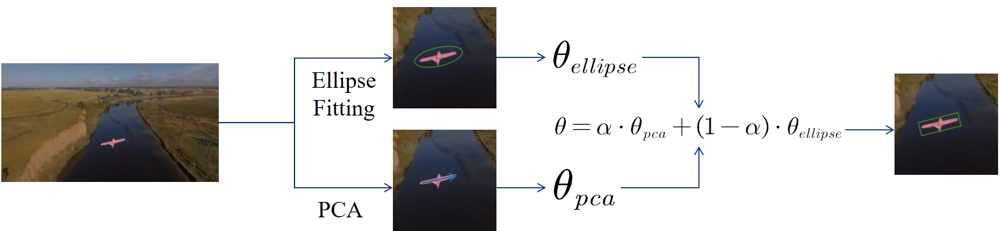

# Rotated Box-Aware Segmentation for Fixed-Wing UAVs: A PCA-Enhanced SiamMask Approach

<p align="center">
  
  
  
</p>


---

## 🚀 Introduction

Accurate segmentation and orientation estimation of fixed-wing UAVs are vital for autonomous aerial operations. However, existing benchmarks often lack **air-to-air perspectives** and **rotation annotations**, which are crucial for understanding a UAV's flight state (e.g., orientation and acceleration).

**Our Key Contributions:**
- **Dataset Augmentation:** We enhanced the **UAV2UAV** and **RSTrack** datasets with high-quality pixel-level masks and rotated bounding boxes using a semi-automatic labeling pipeline.
- **PCA-Enhanced Strategy:** We propose **PCA-SiamMask**, which integrates Ellipse Fitting and Principal Component Analysis (PCA) to refine rotation angle estimation.
- **SOTA Performance:** Our method improves region similarity by **2.7%** and boosts rotated box AUC by **1.8%** compared to baseline methods.

---

## 🛠 Methodology

<p align="center">
  
  <br>
  <em>Figure 1: Overview of the PCA-SiamMask framework.</em>
</p>


The proposed **PCA-SiamMask** leverages the geometric properties of fixed-wing UAVs. By applying PCA to the predicted masks, the model can estimate the principal axes of the target, leading to more stable and accurate rotated bounding boxes even during complex maneuvers.


---

## 📸 Dataset Preview

*Figure 2: Examples of our pixel-level segmentation masks and rotated box annotations for fixed-wing UAVs in air-to-air scenarios.*

---

## 📊 Experimental Results

### Quantitative Evaluation on UAV2UAV (%)

| Tracker | Region Similarity ($\mathcal{J}_M \uparrow$) | Overlap ($\mathcal{J}_O \uparrow$) | Decay ($\mathcal{J}_D \downarrow$) |
| :--- | :---: | :---: | :---: |
| SiamMask [2] | 45.1 | 55.9 | 72.4 |
| **PCA-SiamMask (Ours)** | **47.8** | **59.3** | **66.9** |

### Rotated Bounding Box Performance (AUC Score)

| Algorithm | BACF | ECO | OSTrack | SiamMask | **Ours** |
| :--- | :---: | :---: | :---: | :---: | :---: |
| **AUC** | 0.304 | 0.271 | 0.458 | 0.382 | **0.424** |

---

## 📥 Downloads

### 1. Our Extended Annotations
* **UAV2UAV-Extended (Masks & Rotated Boxes):** [Baidu Netdisk](https://pan.baidu.com/s/1UZTbiseJ6IPR1oK5wJYMyg) (Extraction Code: `75tu`)

### 2. Foundational Datasets
* **UAV2UAV Source:** [Link](https://github.com/hapless19/UAV2UAV-dataset)
* **RSTrack Source:** [Link](https://github.com/TonikLeung/RSTrack)

---

## 📜 Citation

If you find this work or the extended dataset useful for your research, please cite our PRCV 2025 paper:

```bibtex
@inproceedings{li2025rotated,
  title={Rotated Box-Aware Segmentation for Fixed-Wing UAVs: A PCA-Enhanced SiamMask Approach},
  author={Li, Chengwei and Bai, Yunsong and Long, Ruhai and Wang, Yong and Wu, Shunan and Wu, Zhigang},
  booktitle={Proceedings of the 8th Chinese Conference on Pattern Recognition and Computer Vision (PRCV)},
  year={2025}
}
